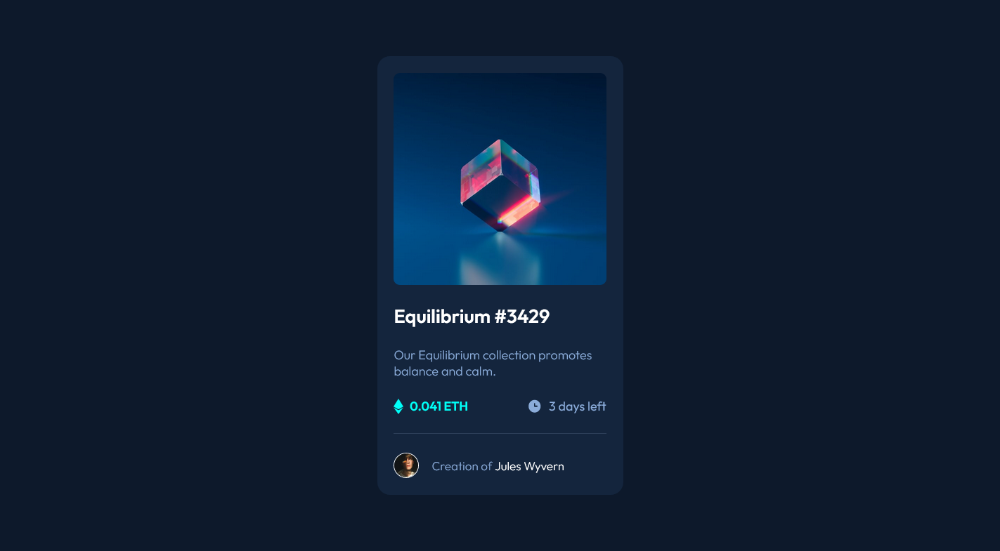

# Frontend Mentor - NFT preview card component solution

This is a solution to the [NFT preview card component challenge on Frontend Mentor](https://www.frontendmentor.io/challenges/nft-preview-card-component-SbdUL_w0U). Frontend Mentor challenges help you improve your coding skills by building realistic projects. 

## Table of contents

- [Overview](#overview)
  - [The challenge](#the-challenge)
  - [Screenshot](#screenshot)
  - [Links](#links)
- [My process](#my-process)
  - [Built with](#built-with)
  - [Continued development](#continued-development)
  - [Useful resources](#useful-resources)

## Overview

### The challenge

Users should be able to:

- View the optimal layout depending on their device's screen size
- See hover states for interactive elements

### Screenshot

### Links

- Solution URL: https://github.com/akosimakoy/nft-preview-card-component-main
- Live Site URL: https://nftpreviewcardfrontendmentor.netlify.app/

### Built with

- Semantic HTML5 markup
- CSS custom properties
- Flexbox
- CSS Grid

### Continued development

In the future I wanted to master the hover state, the advantages and features of it.

### Useful resources

https://developer.mozilla.org/en-US/

## Author

- Website - https://nftpreviewcardfrontendmentor.netlify.app/
- Frontend Mentor - https://www.frontendmentor.io/profile/akosimakoy
